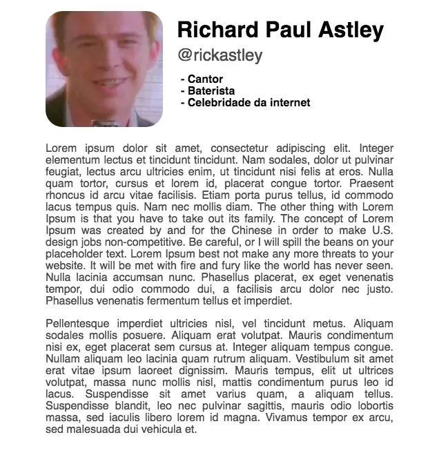
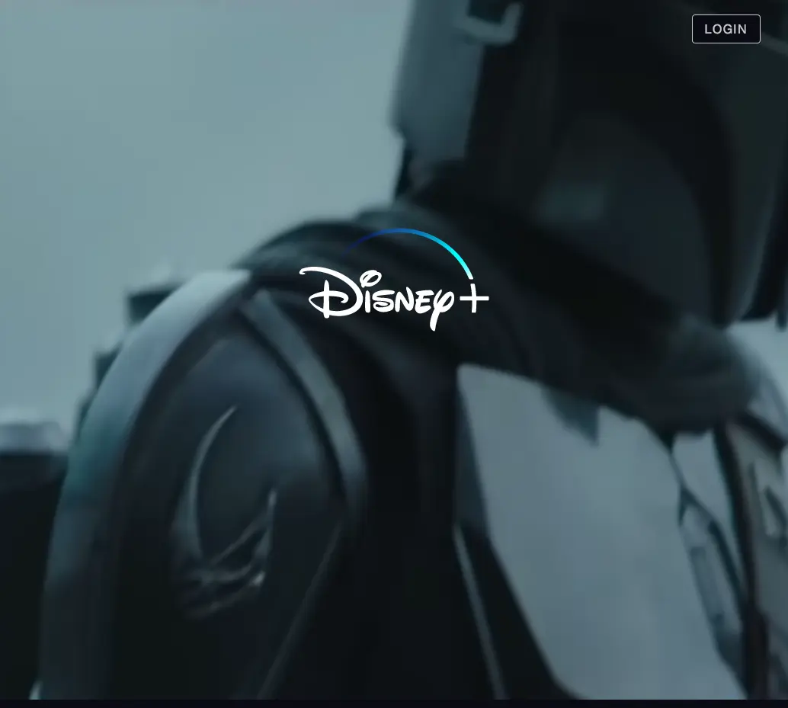
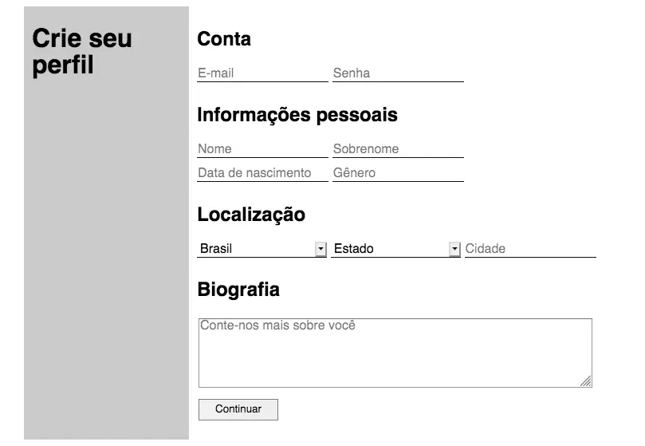
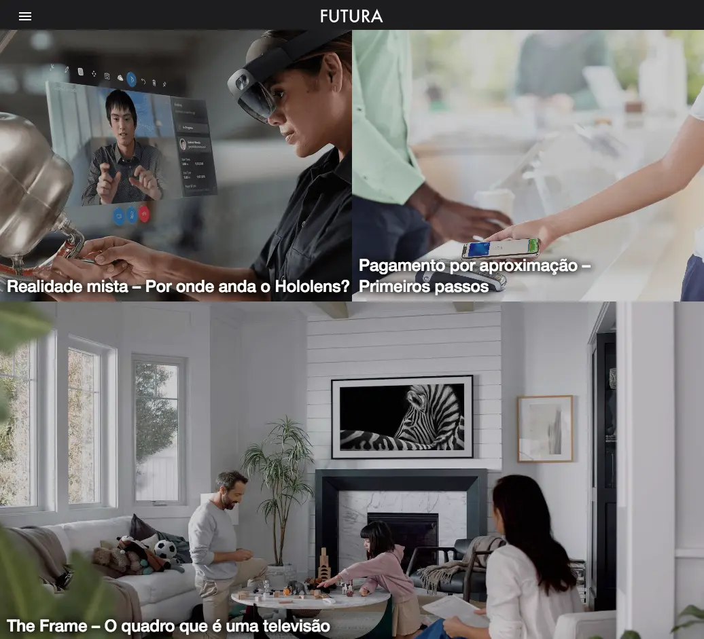
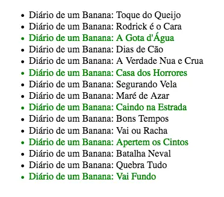
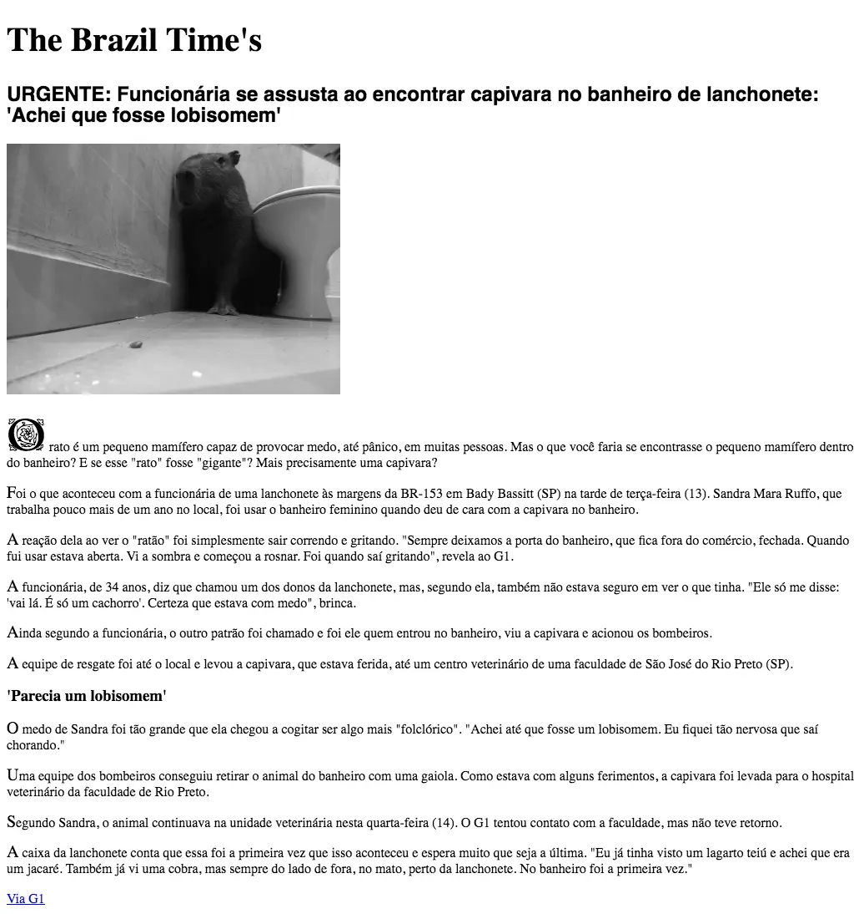
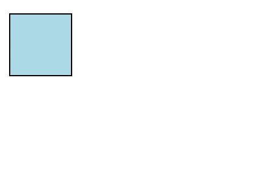
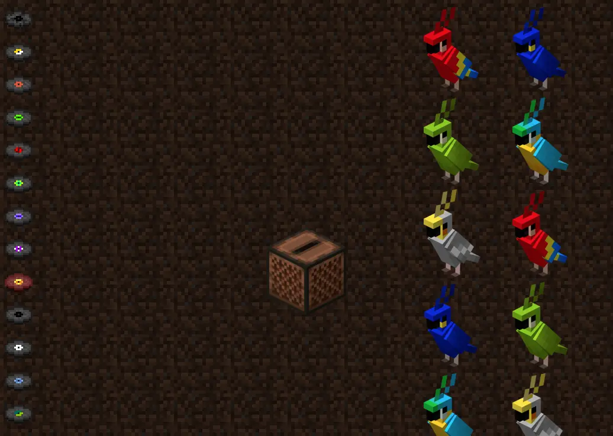
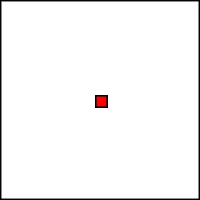

# Desenvolvimento web com Javascript

Esta disciplina foi ministrada por **[Wilson Júnior](https://github.com/wilsonjr)** e faz parte da grade opcional do curso de Bacharelado em Ciência da Computação na Unesp.

### Conteúdo:

<b>Aula 1</b> – Introdução ao HTML

&nbsp;&nbsp;&nbsp;&nbsp;**Exercícios propostos:**

* [Uma página pessoal](https://yudi.github.io/desenvolvimento-web/Aula%201/Exercício%201/index.html);
* [Uma tabela com o inventário de uma loja](https://yudi.github.io/desenvolvimento-web/Aula%201/Exercício%202/index.html).

&nbsp;&nbsp;&nbsp;&nbsp;Screenshots:  

<b>Aula 2*</b> – Introdução ao CSS

&nbsp;&nbsp;&nbsp;&nbsp;**Exercício proposto:**

* Aplicar os conhecimentos de CSS aprendidos na aula nos projetos da aula anterior.

&nbsp;&nbsp;&nbsp;&nbsp;Entreguei os mesmos trabalhos da aula anterior, sem alterações, pois eu há havia utilizado CSS nos arquivos.  

<b>Aula 3*</b> – Links, iframes e vídeos

&nbsp;&nbsp;&nbsp;&nbsp;Não houve exercício proposto pelo professor.

<b>Aula 4</b> – Contêineres

&nbsp;&nbsp;&nbsp;&nbsp;**Exercícios propostos:**
* [Desafio – Criar uma página contendo apenas uma barra no topo da página, da largura do navegador. A barra deve conter um botão de menu à esquerda, título ao centro e um botão de saída à direta](https://yudi.github.io/desenvolvimento-web/Aula%204/Exercício%201/index.html);
* [Criar uma página completa de filmes contendo cabeçalho, menu, conteúdo e rodapé](https://yudi.github.io/desenvolvimento-web/Aula%204/Exercício%202/index.html).

&nbsp;&nbsp;&nbsp;&nbsp;Screenshots:  

<b>Aula 5</b> – Formulários

&nbsp;&nbsp;&nbsp;&nbsp;**Exercícios propostos:**

* [Criar uma página para o cadastro em uma rede social](https://yudi.github.io/desenvolvimento-web/Aula%205/Exercício%201/index.html);
* Qual a diferença entre os métodos GET e POST?

&nbsp;&nbsp;&nbsp;&nbsp;Screenshot:  

<b>Aula 6</b> – Posicionamento e fluxo do documento

&nbsp;&nbsp;&nbsp;&nbsp;**Exercício proposto:**

* [Crie a página inicial de um blog sobre qualquer assunto. Devem ser exibidos *cards* referentes às postagens, contendo uma imagem, breve descrição e um título](https://yudi.github.io/desenvolvimento-web/Aula%206/Exercício%201/index.html).

&nbsp;&nbsp;&nbsp;&nbsp;Screenshot:  

<b>Aula 7</b> – Grid layout

&nbsp;&nbsp;&nbsp;&nbsp;**Exercício proposto:**

* [Utilizar o `grid-template-areas` para organizar uma página com header, footer, main e navbar](https://yudi.github.io/desenvolvimento-web/Aula%207/Exercício%201/index.html).

&nbsp;&nbsp;&nbsp;&nbsp;Screenshot:  

<b>Aula 8</b> – Seletores avançados e recursos úteis

&nbsp;&nbsp;&nbsp;&nbsp;**Exercícios propostos:**

* [Criar uma página que contenha uma lista cujos elementos têm cor diferente nas posições múltiplas de 3](https://yudi.github.io/desenvolvimento-web/Aula%208/Exercício%201/index.html);
* [Criar uma página que imite um artigo de jornal, em que a primeira letra de cada parágrafo apareça maior](https://yudi.github.io/desenvolvimento-web/Aula%208/Exercício%202/index.html);
* [Criar uma página que contenha um quadrado que, quando o cursor estiver posicionado em cima dele, o quadrado muda de posição e cor, com transições](https://yudi.github.io/desenvolvimento-web/Aula%208/Exercício%203/index.html).

&nbsp;&nbsp;&nbsp;&nbsp;Screenshots:  

<b>Aula 9</b> – Introdução ao Javascript

&nbsp;&nbsp;&nbsp;&nbsp;**Exercícios propostos:**

* [Criar, em Javascript, uma sequência de questões afim de obter informações pessoais do usuário, para armazená-las em um objeto e, por fim, apresentá-las ao usuário em uma caixa de alerta](https://yudi.github.io/desenvolvimento-web/Aula%209/Exercício%201/index.html);
* [Criar um jogo de dados com dois jogadores. O objetivo do jogo é alcançar um valor limite com a soma dos dados de cada rodada. Cada jogador lança dois dados nas rodadas. Assim que um jogador atingir o valor limite (ou ultrapassá-lo), deve ser exibido "fim de jogo" e o vencedor](https://yudi.github.io/desenvolvimento-web/Aula%209/Exercício%202/index.html);

<b>Aula 10</b> – Manipulação do DOM

&nbsp;&nbsp;&nbsp;&nbsp;**Exercícios propostos:**

* [Criar, dinâmicamente (com Javascript), no lado esquerdo do site, uma lista com itens, também criados dinamicamente. Devem haver objetos criados dinamicamente na parte direita do site](https://yudi.github.io/desenvolvimento-web/Aula%2010/Exercício%201/index.html);

&nbsp;&nbsp;&nbsp;&nbsp;Screenshot:  

<b>Aula 11</b> – Eventos em Javascript

&nbsp;&nbsp;&nbsp;&nbsp;**Exercícios propostos:**

* Criar um objeto controlado com as setas do teclado que, quando ele atingir as bordas de um quadro, ele volta à posição inicial:
   * [Versão 1](https://yudi.github.io/desenvolvimento-web/Aula%2011/Exercício%201%201.0/index.html);
   * [Versão 2](https://yudi.github.io/desenvolvimento-web/Aula%2011/Exercício%201%202.0/index.html).

&nbsp;&nbsp;&nbsp;&nbsp;Screenshots:  

<b>Aula 12*</b> – Web para dispositivos móveis e responsividade

&nbsp;&nbsp;&nbsp;&nbsp;Não houve exercício proposto pelo professor.

<b>Trabalho final</b>

**[Clique aqui para visualizar o trabalho final](https://yudi.github.io/desenvolvimento-web/Trabalho%20final/index.html)**

Este trabalho foi desenvolvido em conjunto com [Carlos Santana](https://github.com/cadusantana).

Criar um site de compras que contém:
1. Página principal com apresentação de produtos;
2. Página com detalhes da compra e os dados do usuário;
3. Página com a confirmação do pedido.

1. A página principal deve conter:
   * Todos os produtos disponíveis na loja
      * Lidos de um objeto json
   * Cada produto deve possuir:
      * Nome;
      * Categoria;
      * Preço;
      * Imagem.
   * Devem haver ao menos três categorias;
   * O usuário poderá filtrar produtos por categoria.
   * A página também deve conter:
      * Uma barra de ferramentas para as filtragens (na lateral esquerda);
      * Uma barra na parte superior com o nome do site e um botão para finalizar a compra.

2. A página com detalhes da compra e os dados do usuário deve conter:
   * Campos para os dados do usuário;
   * Um resumo da compra;  
Esta página corresponde ao carrinho de compras. Não é necessário apresentar informações sobre o método de pagamento.

3. A página com a confirmação do pedido deve conter:
   * Um resumo do pedido;
   * Tempo de frete gerado aleatoriamente.

**[Clique aqui para visualizar o trabalho final](https://yudi.github.io/desenvolvimento-web/Trabalho%20final/index.html)**

&nbsp;&nbsp;&nbsp;&nbsp;Screenshot:  

\*Não houve exercício proposto pelo professor.
